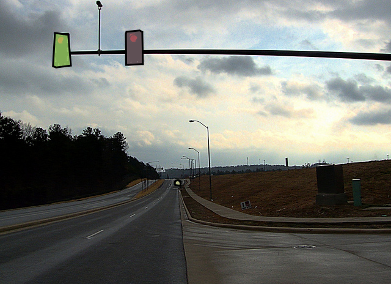
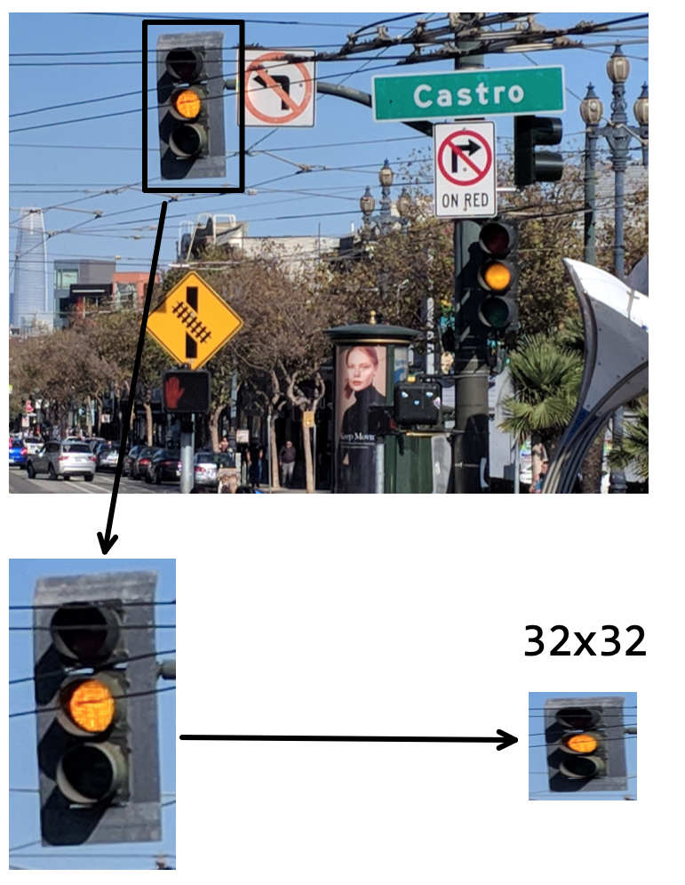
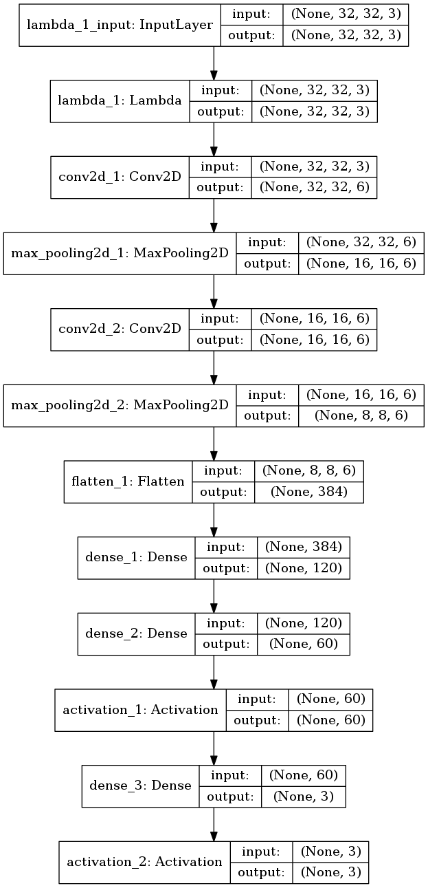

# A deep neural network based fully automatic traffic light detection system #
#### Machine Learning Engineer Nanodegree - Capstone Project ####
Alberto Vigata  

[demonstration video](http://www.youtube.com/watch?v=H-SrcDeF63c)

[](http://www.youtube.com/watch?v=H-SrcDeF63c)


## 0. Setup
Requirements
* This project needs separate big files that are not included by default in the repository. Run `setup.sh` to download models and validation images and videos.
* Python 3 is required with the following libraries
    * numpy
    * keras
    * tensorflow
    * opencv
    * moviepy

## I. Definition

### Project Overview
This project deals with the creation of a system to detect traffic signals in an image, and in turn, detect the state of such signals. In order to create this system we'll need the help of tools in the realm of computer vision. 

Historically image semantic segmentation and inference has been an active field of study, but it wasn't until the advent of deep neural networks when breakthroughs did happen. In particular, [this paper released in 2014 (2014, Fully Convolutional Networks (FCN) by Long et al.)](https://arxiv.org/abs/1411.4038) spearheaded a new successful approach in the field. Since then, multiple new architectures have improved in the segmentation accuracy, a good review can be seen [here](http://blog.qure.ai/notes/semantic-segmentation-deep-learning-review)

### Problem Statement
The problem to be solved consists in creating a system that is fed real world images and it's able to identify traffic signals in the images and then in turn, identify the state of such signal as *green*, *yellow* or *red*. Such system could be used in autonomous systems to gain awareness of right of way. 

The inputs to the system are single images, and images only. The outputs of the system will be a logical output affirming if a traffic light is present, and if present what's the current state of the traffic light, *green*, *yellow* or *red*.

Because we'll have a ground truth from our testing images we'll be able to easily identify if our system is performing as expected or not.

In order to achieve the result we will split up the problem in two stages:
- A image segmentation stage, to find out the location of the traffic signals
- A image classification state, to establish the state of the traffic signal

### Metrics
We will use the following two metrics to measure the performance of our system:
- For the inference stage we will use a model with the higest mean average precision (mAP) possible [definition here](https://medium.com/@jonathan_hui/map-mean-average-precision-for-object-detection-45c121a31173)
- On the image classification state, we will use a validation set on the training data to test the validation loss and accuracy
- On the final system, we will gauge the overall accuracy of our system with a simple binary rule:
    - The system can never wrongly detect the state of a green/red signal
  


## II. Analysis

### Data Exploration

#### Segmentation stage ####
We will use the COCO dataset, publicly available at [http://cocodataset.org](http://cocodataset.org). COCO dataset is a large dataset that has a lot of the features we need, in particular object segmentation. It's also a large dataset of 330K images with over 1.5 million objects represented. 

One the categories that the dataset classifies for is "traffic light" which will be of interest in this project. Here's one example of an image in the dataset:



MSCOCO dataset provides input images with different classes, car, bicycle, human and traffic lights. Every object in the dataset has been segmented so we can feed it to a model for future inference.

#### Classification state ####
In order to classify the signals in its color state, I have created a dataset manually by merging 32x32 pictures of traffic signals from different sources: web scraping, car simulators and manual street picture taken in San Francisco. This 32x32 images will be fed to a model to classify the color of the light. It has to learn light state on its own. 



The full dataset for classification is under the 'training/prep' folder in this repository.

We will use the traffic light images for classification with a CNN and we expect our model to learn all the different intricacies like:
- yellow tone. different areas provide different hues for yellow light
- angle in the image from the camera point of view. Model should be robust to identifying the light even if we see it slightly at an angle.
- obstructing objects. Like in the example above, model should be robust to id the state even if there are object that partially obfuscate the view.

#### Final validation state
 
### Exploratory Visualization

1. MSCOCO dataset (2017) is a huge dataset with 123,287 images which contain 886,284 instances of different objects classified per type. 

2. Our smaller traffic light state classification dataset of 32x32 pictures. The dataset set resides under `training/prep` and the signals are labeled for green, yellow and red ( a different folder for each) The total feature count for every item is

| green | yellow | red |
|-------|--------|-----|
|  431 | 159 | 187 |

3. The third visual dataset is the dataset for validation. It consists of images and videos with or without traffic lights. The goal for the system is to correctly identify the location of lights and status. The reside under `videos` and `images` folder. Here's 4 randomly picked samples from the validation dataset:

### Algorithms and Techniques

We will make heavy use of CNN (Convolutional Neural Networks) for both steps. In particular:

#### Segmentation and inference stage ####
We need an inference model to figure out the regions of the image where the traffic signals exist. We have established we will used the COCO dataset for training. We could try to come up with our own model, but this is a problem that has been extensively researched. Here are a few of the most successful techniques employed for inference of objects compared in speed and their gross performance on the COCO dataset:

|  inference type |  speed |  COCO performance | technique description |
|-----------------|--------|-----------------|-----------------------|
| Single shot detection| fast |average | [link](https://medium.com/@ManishChablani/ssd-single-shot-multibox-detector-explained-38533c27f75f) 
|Region based Fully convolutional networks | medium | good | [link](https://arxiv.org/abs/1605.06409) |
|Region proposal CNNs| slow | best | [link](https://medium.com/@smallfishbigsea/faster-r-cnn-explained-864d4fb7e3f8) |  

Tensorflow provides multiple pretrained models on the COCO dataset of the above techniques and are available for download. We'll use them as is in our system and we'll experiment with the different speed and performance characteristics. 

| Model name  | Speed | COCO mAP | Outputs |
| ------------ | :--------------: | :--------------: | :-------------: |
| [ssd_mobilenet_v1_coco](http://download.tensorflow.org/models/object_detection/ssd_mobilenet_v1_coco_11_06_2017.tar.gz) | fast | 21 | Boxes |
| [ssd_inception_v2_coco](http://download.tensorflow.org/models/object_detection/ssd_inception_v2_coco_11_06_2017.tar.gz) | fast | 24 | Boxes |
| [rfcn_resnet101_coco](http://download.tensorflow.org/models/object_detection/rfcn_resnet101_coco_11_06_2017.tar.gz)  | medium | 30 | Boxes |
| [faster_rcnn_resnet101_coco](http://download.tensorflow.org/models/object_detection/faster_rcnn_resnet101_coco_11_06_2017.tar.gz) | medium | 32 | Boxes |
| [faster_rcnn_inception_resnet_v2_atrous_coco](http://download.tensorflow.org/models/object_detection/faster_rcnn_inception_resnet_v2_atrous_coco_11_06_2017.tar.gz) | slow | 37 | Boxes |


#### Classification stage ####
For the classification state we will use a simple LeNET style CNN to which we will feed the resized output (32x32) of the boxes from the inference stage. Our network has the following topology:
 

After training we end with a keras compiled model we can use on our main detector.

### Benchmark
For benchmarking the system we will use the metrics stated above.
Of particular interest will be the accuracy and validation loss in our testing set on the classification stage, and the lack of failures of the system when identifying status of the light.


## III. Methodology

### Data Preprocessing
#### Segmentation and inference stage ####
We will use pretrained models on the inference stage, therefore we can feed images directly to it without further modification.

#### Classification stage ####
For our classification stage, it's important to preserve the color of the light, thus RGB images will be fed to the classification stage. Additionally to reduce training times and complexity we will downsample all of our features to 32x32 RGB images.

### Implementation
Let's take a look at the overview of our system implementation:


#### Overview of implementation ####
We use a mixture of tensorflow and keras code to carry out the tasks in the project. The main core of the code lies in detector.py. This block of code is responsible to instantiate the inference model, resize output and feed the classification CNN.

#### Inference model ####
Our implementation under `detector.py` allows to use multiple pretrained models pointed out before. The fundamental reason to choose one model or the other is a trade-off between running speed and mAP values. Our default model is using RCNNs, that seem to be very accurate providing inferences boxes.

#### Classification training ####
There's a separate path in our code tree that performs training and validation on the classification CNN. Such code is under the `training` folder. Running it produces a `model.h5` keras model that will be imported by the `detector.py` code. 

#### Python details ####
Main code in python can work on images and videos and produced 'tagged' images with image state and box inference.


### Refinement
The following is a discussion regarding steps taken to improve results of the system.

#### Breath of training data for classification ####
It was noted during the development of the project, that the yellow color of the traffic signals, its hue and saturation depends on the locality. It is thus of interest to train the model for the particular area of use. In our case we used images mostly base in the San Francisco bay area where yellow lights tend to have a orange tone. 

Also we tried to incorporate different views from different angles in the dataset to make the classification more robust.

CNN was trained on 50 epochs yielding usually validation losses of an order of magnitude ~ 1E-05

## IV. Results

### Model Evaluation and Validation

#### RCNN model election ####
The multiple models noted above where tried for system performance and running time. After an iterative process we decided to settle on a "Region Proposal CNN" architecture as it offers excellent performance on the COCO dataset and it's relatively fast. A detailed explanation of the rationale behind RCNNs can be found [here (Faster R-CNN: Towards Real-Time Object
Detection with Region Proposal Networks, Shaoqing Ren et at)](https://arxiv.org/pdf/1506.01497.pdf) RCNNs can achieve mAPs on COCO between 32 and 37 mAP.

#### classification CNN ####
The particular CNN used for color light classification has been outlined above, and the training code and keras implementation can be found under `training/train_keras_classifier.py`. We use a sufficient number of epochs to achieve lowest validation error possible. After 50 epochs we obtain validation losses in the order of 1E-05 which is acceptable. Here's an example from the end of a run of training:

```
...
Epoch 48/50
543/543 [==============================] - 0s 821us/step - loss: 1.9570e-05 - val_loss: 7.5077e-06
Epoch 49/50
543/543 [==============================] - 0s 836us/step - loss: 1.8792e-05 - val_loss: 7.2065e-06
Epoch 50/50
543/543 [==============================] - 0s 886us/step - loss: 1.8363e-05 - val_loss: 7.2853e-06
```

#### Overall model performance ####
We achieved the portrayed goals with this particular implementation of our system. Validation loss is low, inference is acceptable and there are no errors in our image validation set. Model seems trustworthy. 


## V. Conclusion

### Putting it all together

Here's a video with the system correctly identifying signals and signal status. Notice how system correctly tags signals when in view and also correctly tags their status.

[demonstration video](http://www.youtube.com/watch?v=H-SrcDeF63c)

[](http://www.youtube.com/watch?v=H-SrcDeF63c)

Our detection also works well in our validation image dataset. Here are a few examples:


### Reflections and random thoughts
Although the system is working correctly in our siloed testing setup we can't establish performance of it with other imaging coming from other areas. Results and performance could be drastically different due to differences in traffic light shape and color. In particular the color of the yellow lighting seems to be a problem given than different markets have different hues. It is however an issue than can be mitigated due to the fact that the main data triggers are 'red' and 'green' and the transitional 'yellow' status is not so important.

The chosen RCNN runs at about 7 seconds/image on a comtemporary intel Core i5 CPU. It's likely to run an order magnitude faster if we run the tensorflow code on a GPU. That would still put performance at around 2 frames/second which would be acceptable for realtime applications.


### Improvements ###
#### speed ####
The code could be run on GPU hardware to make it achieve 'real-time' status instead of the CPU based setup used here.

#### inference application specific models ####
Our use of out-of-the-box inference models maybe a limiting factor in terms of optimization for our problem. The models are trained in the COCO dataset and are classifying for object types we don't have interest for in this application. Therefore spending effort in training models exclusively focused on traffic signals could greatly diminish the complexity of the model and improve their speed.

#### night dataset and operation ####
All our imaging was done with daytime datasets and will only work during day time. Night time light detection comes with additional challenges specially when it comes to inference of the traffic light signals. 

* Possible solutions could be improvements in camera imaging with higher exposures that would reveal the features of the traffic signals. 
* completely different architecture for signal detection based exclusively on signal status within the picture

